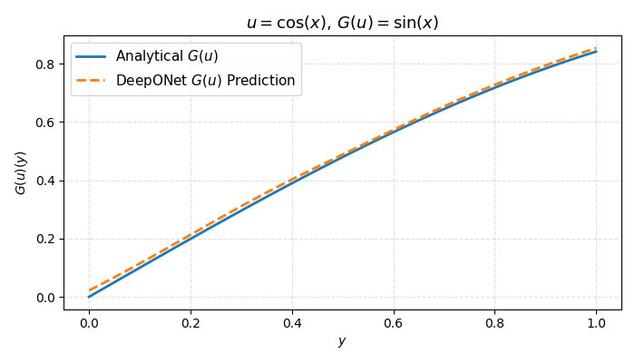
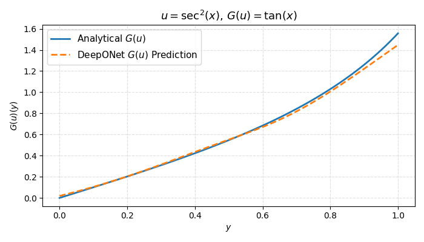
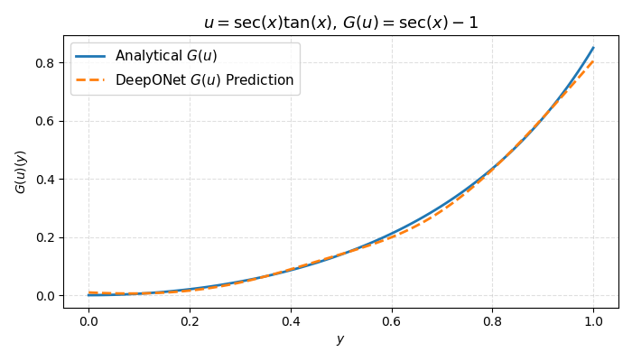
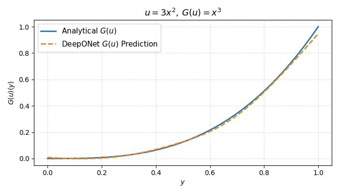
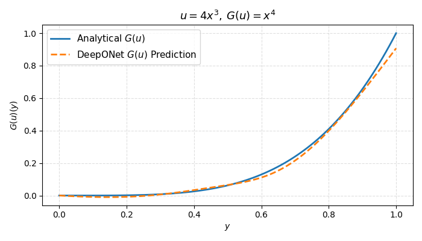
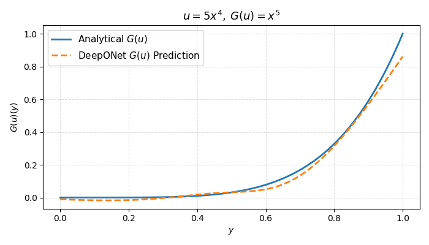
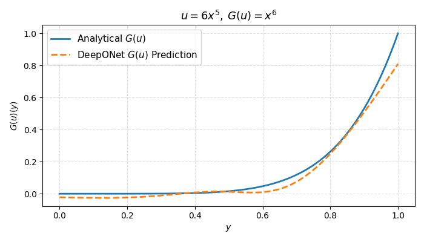
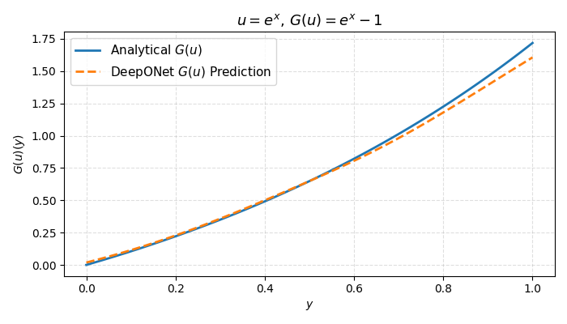

# MindSpore-DeepONet 

## 项目简介

本项目基于 MindSpore 实现了 DeepONet 算子学习网络，旨在展示深度学习方法在泛函/算子回归上的强大表达能力。**DeepONet** 作为一种深度算子网络模型，可以拟合输入函数到输出函数之间的映射关系，被广泛应用于偏微分方程（PDE）求解、科学模拟、控制等众多科学与工程场景。

## 背景介绍

根据机器学习的万能近似定理，神经网络不仅可以拟合输入到输出的函数映射，也可以扩展到**函数与函数之间的映射（算子）**，这就是“算子学习”的核心。DeepONet 在很多领域均有潜力，例如：

- 流体动力学模拟：数值求解 Navier-Stokes 方程等
- 图像/信号处理：医学图像、语音、雷达等
- 控制系统、金融、环境科学等预测优化

**DeepONet 的本质是学习泛函映射**，例如通过网络实现积分、导数等复杂操作。与传统点对点拟合相比，DeepONet 直接对输入函数的整体作用进行学习。

---

## 数据集说明

本项目采用 [DeepXDE 官方 antiderivative_unaligned 数据集]([https://paddle-org.bj.bcebos.com/paddlescience/datasets/DeepONet/](https://yaleedu-my.sharepoint.com/personal/lu_lu_yale_edu/_layouts/15/onedrive.aspx?ga=1&id=%2Fpersonal%2Flu%5Flu%5Fyale%5Fedu%2FDocuments%2Fdatasets%2Fdeepxde%2Fdeeponet%5Fantiderivative%5Funaligned))，分为训练集和测试集，文件格式如下：

- **antiderivative_unaligned_train.npz**
  - `X_train0`：u 的训练输入数据，形状 (10000, 100)
  - `X_train1`：y 的训练输入数据，形状 (10000, 1)
  - `y_train` ：G(u) 的训练标签数据，形状 (10000, 1)
- **antiderivative_unaligned_test.npz**
  - `X_test0` ：u 的测试输入数据，形状 (100000, 100)
  - `X_test1` ：y 的测试输入数据，形状 (100000, 1)
  - `y_test`  ：G(u) 的测试标签数据，形状 (100000, 1)

**数据下载：**
```bash
# Linux
wget -nc https://paddle-org.bj.bcebos.com/paddlescience/datasets/DeepONet/antiderivative_unaligned_train.npz
wget -nc https://paddle-org.bj.bcebos.com/paddlescience/datasets/DeepONet/antiderivative_unaligned_test.npz

# Windows (可选)
curl https://paddle-org.bj.bcebos.com/paddlescience/datasets/deeponet/antiderivative_unaligned_train.npz -o antiderivative_unaligned_train.npz
curl https://paddle-org.bj.bcebos.com/paddlescience/datasets/deeponet/antiderivative_unaligned_test.npz -o antiderivative_unaligned_test.npz
```

## 代码结构

```text
.
├── train.py          # 训练主程序
├── eval.py           # 测试与可视化脚本
├── antiderivative_unaligned_train.npz   # 训练数据集
├── antiderivative_unaligned_test.npz    # 测试数据集
├── ckpts/            # 模型权重保存目录
├── figures/          # 可视化结果输出目录
└── README.md         # 项目说明文档
```


## 启动训练
```bash
python train.py
```

## 评估模型并生成可视化结果
```bash
python eval.py
```

## 部分结果展示

下面是部分测试可视化结果：












你可以在 `figures` 文件夹中找到所有测试过的函数可视化结果。

## 致谢
本项目来源于北航AI学习框架与科学计算课程，在此感谢授课的两位老师以及华为提供的计算资源～
